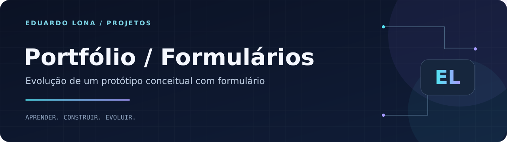

<strong>HTML · CSS · JavaScript · FormSubmit</strong>

<a href="#sobre">Sobre</a> · <a href="#como-executar">Como executar</a> · <a href="https://github.com/Dudulonabr">Perfil do autor</a>

# Portfólio do Futuro — Formulários

## Sobre

Protótipo acadêmico de portfólio construído com **HTML, CSS e JavaScript**, usando uma **trajetória profissional fictícia ambientada no futuro**. As referências a projetos globais, pós-graduações, liderança e especializações fazem parte do exercício criativo.

Para conhecer minha formação e projetos atuais, consulte o [Portfólio profissional](https://github.com/Dudulonabr/Portifolio).

## Aprendizados

Estrutura de uma página pessoal, hierarquia de conteúdo, navegação entre seções, estilização, adaptação do menu e efeito de digitação.

Esta versão acrescenta um formulário com campos de nome, e-mail, telefone e mensagem, configurado para envio por um serviço externo (FormSubmit). O recebimento depende da configuração e ativação do serviço.

## Como executar

Clone o repositório e abra `index.html` no navegador. Os estilos estão em `css/estilo.css` e as imagens locais em `img/`. Recursos externos dependem de internet.

## Autor

**Eduardo Moreira Monteiro Lona** · São Paulo, Brasil

Estudante de **Análise e Desenvolvimento de Sistemas (UNIP)** e **Engenharia de Software (Cruzeiro do Sul)**, com formação técnica em **Informática pelo SENAC**.

[LinkedIn](https://www.linkedin.com/in/eduardo-moreira-monteiro-lona) · [E-mail](mailto:dudulona07@gmail.com) · [GitHub](https://github.com/Dudulonabr)
